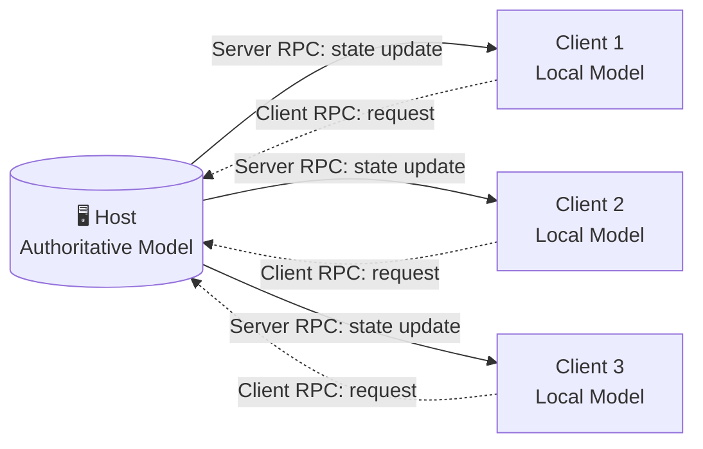

<div align="center">

# 🎣 Go Fish
### A Networked, Cloud-Connected Reimagining of the Classic Card Game

*Built with Unity · Powered by Netcode · Backed by PlayFab*

<br/>


<br/>


</div>

<br/>

> **Go Fish** takes the card game you grew up with and gives it a server-authoritative brain, a probability-tracking AI opponent, and a cloud profile that follows you across devices. Under the hood it's a strict **MVC** architecture — under the hood of *that*, it's just really trying to make you say "Go Fish!" out loud.

<div align="center">

<!-- 🎬 Drop a gameplay GIF or screenshot here — first impressions sell the repo -->
*🖼️ Screenshots & gameplay preview coming soon — see [Contributing](#-contributing) if you'd like to help capture some!*

</div>

---

## 📑 Table of Contents

- [Overview](#-overview)
- [Key Features](#-key-features)
- [Technology Stack](#️-technology-stack)
- [Architecture](#-architecture)
- [Getting Started](#-getting-started)
- [How to Play](#-how-to-play)
- [Project Structure](#-project-structure)
- [Roadmap](#-roadmap)
- [Contributing](#-contributing)
- [License](#-license)
- [Acknowledgments](#-acknowledgments)

---

## 📖 Overview

**Go Fish** is a cross-platform digital implementation of the classic card game, built in Unity and C#. It's engineered from the ground up on a strict **Model-View-Controller (MVC)** architecture, so the mathematical rules of the game — shuffling, dealing, book-matching — never know or care that they're being rendered on a screen. That separation is what lets the same core logic power a local hotseat match, a LAN game, and a full cloud-synced multiplayer session without being rewritten.

On top of that foundation sits real-time networking via **Unity Netcode for GameObjects** and persistent player data via **Azure PlayFab** — turning a five-minute card game into a proper multiplayer product.

---

## ✨ Key Features

| | Feature | Description |
|---|---|---|
| 🧠 | **Memory-Observation Smart AI** | Rather than rolling dice, the AI remembers every query made against it and builds a live probability map of hidden hands — resulting in strategic, human-like play instead of random guessing. |
| 🌐 | **Real-Time Multiplayer** | Built on **Unity Netcode for GameObjects** using a secure Client-Host topology. All state changes are server-authoritative, closing the door on client-side cheating. |
| ☁️ | **Cloud Player Profiles** | **Azure PlayFab** stores persistent profiles, display names, avatars, and global win/loss stats — your identity and stats travel with you. |
| 📐 | **Enterprise-Grade Architecture** | Strict **MVC** separation. Core operations (Fisher–Yates shuffling, O(1) card draws, dynamic hand sorting) are pure math, fully decoupled from Unity's rendering layer. |
| 📱 | **Cross-Platform Play** | Ships to **Windows**, **macOS**, and **Android** from a single codebase. |

---

## 🛠️ Technology Stack

| Layer | Technology |
|---|---|
| Game Engine | Unity 2022 LTS |
| Language | C# |
| Networking | Unity Netcode for GameObjects |
| Backend / Database | Microsoft Azure PlayFab |
| Design Pattern | Model-View-Controller (MVC) |

---

## 🏗️ Architecture

### MVC Data Flow

The **Model** never imports `UnityEngine`. The **View** never touches game rules. The **Controller** is the only thing allowed to talk to both — which means the entire ruleset is unit-testable outside of Unity, and the visuals can be reskinned without touching a single line of game logic.

```mermaid
graph TD
    subgraph Model["🧮 Model — pure C#, no Unity dependency"]
        Card[Card] --> Deck[Deck<br/>Fisher-Yates Shuffle]
        Deck --> Hand[Hand<br/>O(1) Draw / Sort]
    end

    subgraph Controller["🎮 Controller — the only layer that talks to both sides"]
        Input[Input Handler] --> RPC[Network RPC Layer]
        RPC --> State[Game State Manager]
    end

    subgraph View["🖼️ View — Unity GameObjects & UI"]
        Render[Card Renderer] --> UI[UI Manager]
        UI --> Anim[Animation System]
    end

    State -->|reads / mutates| Model
    State -->|raises events| View
```

### Network Topology — Client-Host

The Host owns the single **Authoritative Model** — the real deck, the real hidden hands. Every remote client holds only a **Local Model**, which is a projection updated exclusively through explicit Server RPCs. A client can *ask*, but only the Host can *decide*.



---

## 🚀 Getting Started

### Prerequisites

- [Unity Hub](https://unity.com/download) with **Unity 2022 LTS** installed
- *(Optional)* An active [Azure PlayFab](https://playfab.com/) account if you plan to point the project at your own Title ID

### Installation

1. **Clone the repository**
   ```bash
   git clone https://github.com/yourusername/GoFishGame.git
   ```

2. **Open in Unity Hub**
   Launch Unity Hub → **Add Project** → select the cloned `GoFishGame` folder.

3. **Let Unity resolve packages**
   Dependencies such as *Unity Netcode for GameObjects* and *Sirenix Odin Inspector* will be restored automatically on first open.

4. **Press Play**
   Open the main scene under `Assets/Scenes/` and hit **▶ Play** in the Editor.

---

## 🎮 How to Play

1. **Objective** — Collect "Books" (four cards of the same rank). Most books when the deck runs out wins.
2. **On your turn** — Ask another player for a specific rank. You must already hold at least one card of that rank to ask for it.
3. **If they have it** — They hand over every card of that rank, and you get to ask again.
4. **If they don't** — They say *"Go Fish!"* and you draw from the deck. Draw the rank you asked for, and you go again.
5. **Scoring** — The moment you hold four of a kind, a Book locks in automatically and your score ticks up.

---

## 📂 Project Structure

> Indicative layout based on the architecture above — adjust to match your actual folder names.

```
GoFishGame/
├── Assets/
│   ├── Scenes/
│   │   └── MainGame.unity
│   ├── Scripts/
│   │   ├── Model/
│   │   │   ├── Card.cs
│   │   │   ├── Deck.cs
│   │   │   └── Hand.cs
│   │   ├── Controller/
│   │   │   ├── GameController.cs
│   │   │   ├── NetworkController.cs
│   │   │   └── AIController.cs
│   │   └── View/
│   │       ├── CardView.cs
│   │       ├── HandView.cs
│   │       └── UIManager.cs
│   ├── Prefabs/
│   ├── Art/
│   └── Plugins/
│       └── PlayFabSDK/
├── ProjectSettings/
├── Packages/
└── README.md
```

---

## 🗺️ Roadmap

- [x] Core game logic under MVC
- [x] Netcode client-host multiplayer
- [x] PlayFab cloud profiles & stats
- [x] Memory-Observation Smart AI
- [ ] Polished mobile UI / touch controls
- [ ] In-game voice or text chat
- [ ] Ranked / tournament matchmaking
- [ ] Steam or itch.io release

*Have an idea? Open an issue and pitch it.*

---

## 🤝 Contributing

Contributions are welcome and appreciated!

1. Fork the repository
2. Create a feature branch (`git checkout -b feature/amazing-feature`)
3. Commit your changes (`git commit -m "Add amazing feature"`)
4. Push to the branch (`git push origin feature/amazing-feature`)
5. Open a Pull Request

Please keep the Model layer free of `UnityEngine` references — that separation is the whole point of the architecture.

---

## 📄 License

Distributed under the **MIT License**. See `LICENSE` for details.

---

## 🙏 Acknowledgments

- **Unity Technologies** — engine and Netcode for GameObjects
- **Microsoft Azure PlayFab** — backend and player data platform
- Everyone who ever lied about not having any twos

<div align="center">
<br/>

*Developed for fun, strategy, and seamless multiplayer gameplay.* 🎣

</div>
